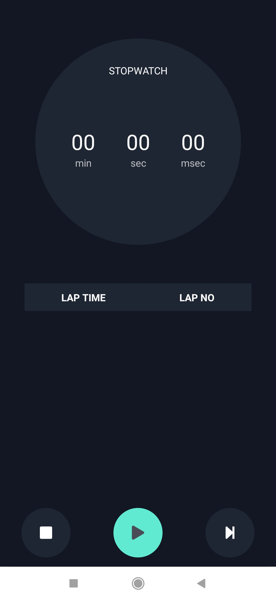
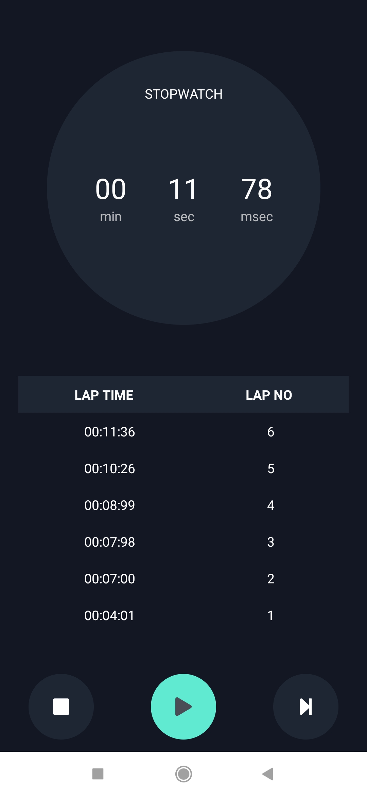

# MyStopwatch - React Native

Welcome to MyStopwatch App built with React Native! Keep track of time with precision and simplicity. Whether you're timing your workouts, cooking, or any other activity, MyStopwatch ensures an easy and efficient experience.

## Table of Contents

- [Introduction](#introduction)
- [Features](#features)
- [Installation](#installation)
- [Usage](#usage)
- [Technologies Used](#technologies-used)
- [Contributing](#contributing)

## Introduction

The Coffee Shop App is a React Native application designed to provide users with a convenient and enjoyable way to explore and purchase different types of coffee and coffee beans. With features like favoriting, various purchasing modes, and an easy-to-use cart, coffee enthusiasts can indulge in their love for quality coffee.

             

## Features

- **Precise Timing:** Accurately measure time with start, stop, and reset functionality.
- **Lap Timer:** Record and view split times for different intervals.
- **Countdown Timer:** Set a specific duration and countdown with ease.

## Installation

1. Clone the repository.
   ```bash
   git clone https://github.com/your-username/password-generator-react-native.git
   ```
2. Install dependencies using your preferred package manager.
   ```bash
   npm install
   ```
3. Run the app:

   ```bash
   npm start

   ```

## Usage

1. Run the app: npm start
2. Open the app on your device using the Expo Go app or an emulator.

## Technologies Used

- **React Native:** A JavaScript framework for building native mobile applications, providing a smooth and efficient cross-platform development experience.

- **Expo CLI:** Utilized for developing, testing, and building the React Native application. Expo CLI simplifies the development workflow and enhances the overall development experience.

- **JavaScript (ES6+):** The primary programming language for developing the application, including the use of modern JavaScript features to enhance code readability and maintainability.

- **npm:** The Node Package Manager is used for installing and managing project dependencies. The `npm install` command is used to fetch and install the necessary packages.

- **Git:** Version control system employed for tracking changes, collaborating with others, and managing the project's source code.

## Contributing

Contributions are welcome! Feel free to open an issue or submit a pull request.
